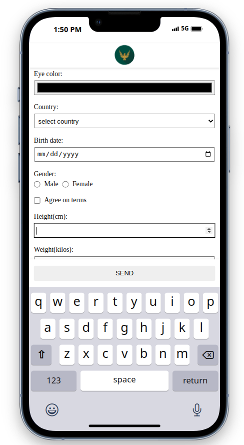

# Smart float element implemented in pure JavaScript

Live Site URL: https://hebrerillo.github.io/smart_float/

Problem: On mobile devices, when the user focuses on an input text for example, the mobiel keyboard appears. This could cause that some floating elements could hide some important elements, like other input fields, and so causing a bad user experience.

The screenshot below shows the problem: The floating element hides part of an input element (the weight input element).

The goal of this project is to implement a smart way to hide and show back the floating element.

The floating element will be hidden in the following cases:

- When the user focus on an input that causes the mobile keyboard to show up, like text, password, email, etc...

- When the user scrolls down the page and the focused element is an input that causes the mobile keyboard to appear.

The floating element will be shown in the following cases (regardless of whether the mobile keyboard is being displayed):

- After 5 seconds of inactivity.

- When the user scrolls up the page.

- When the user has reached the end of the form.

- When the user clicks on an element that does not cause the mobile keyboard to appear.

This is a sample video showing the behaviour of the floating element:

https://hebrerillo.github.io/smart_float/screen_shots/sample.mp4
